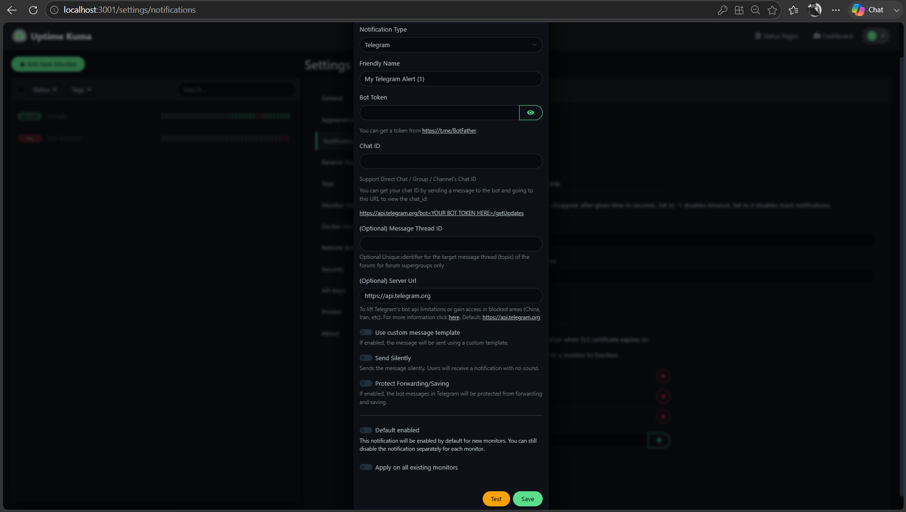

# Configure Telegram Notifications

Uptime Kuma can send Telegram notifications when a monitor changes status. This allows you to receive an alert when a monitored service goes Down and another notification when it recovers.

This guide shows you how to create a Telegram bot, connect it to Uptime Kuma, and enable notifications for a monitor.

## Before you begin

Make sure you have:

- A running Uptime Kuma instance.
- At least one configured monitor.
- A Telegram account.

You will create a Telegram bot and use its bot token and chat ID to connect Telegram to Uptime Kuma.

> **Security:** Treat your Telegram bot token as a secret. Do not include it in screenshots, documentation, Git repositories, or other publicly accessible files.

## Create a Telegram bot

1. Open Telegram.
2. Search for **BotFather**, Telegram's official bot-management bot.
3. Start a conversation with BotFather.
4. Send:

   ```text
   /newbot
   ```

5. Follow the prompts to choose a name for the bot.
6. Choose a username for the bot. Telegram requires bot usernames to end in `bot`.
7. Copy the HTTP API token generated by BotFather.

Keep the token secure. You will need it when configuring Uptime Kuma.

## Start a conversation with your bot

Before retrieving the chat ID, open the bot you just created in Telegram.

Select **Start** or send the bot a message, such as:

```text
hello
```

This creates an update that can be retrieved through the Telegram Bot API.

## Get your Telegram chat ID

In a browser, enter the following address, replacing `<BOT_TOKEN>` with the token generated by BotFather:

```text
https://api.telegram.org/bot<BOT_TOKEN>/getUpdates
```

> **Security:** The URL contains your bot token. Do not share the complete URL or include it in screenshots.

The response contains information about recent interactions with the bot.

Find the `chat` object and locate its `id` value. For example:

```json
{
  "chat": {
    "id": 123456789
  }
}
```

Copy only the chat ID.

## Add Telegram to Uptime Kuma

1. Sign in to Uptime Kuma.
2. Open **Settings**.
3. Select **Notifications**.
4. Select **Set Up Notification**.
5. From **Notification Type**, select **Telegram**.
6. Enter a recognizable **Friendly Name** for the notification.
7. Paste the bot token into **Bot Token**.
8. Enter the chat ID in **Chat ID**.

For a basic setup, leave the optional Telegram settings at their defaults.



*Telegram notification settings in Uptime Kuma.*

## Test the Telegram connection

Before saving the notification, select **Test**.

If the configuration is correct, Uptime Kuma sends a test message to the specified Telegram chat.

During our test, Telegram received:

```text
My Telegram Alert (1) Testing
```

Receiving the test message confirms that Uptime Kuma can communicate with the Telegram bot and deliver a message to the specified chat.

If the test succeeds, select **Save**.

## Enable the notification for a monitor

Creating a notification provider does not necessarily mean that every existing monitor uses it.

To enable the Telegram notification for a monitor:

1. Open the monitor.
2. Select **Edit**.
3. Find **Notifications**.
4. Select the Telegram notification you created.
5. Save the monitor.

Uptime Kuma can now send Telegram alerts for relevant status changes on that monitor.

## Test a Down notification

To test the notification safely, use a dedicated test monitor rather than intentionally disrupting a real service.

For example, our test monitor used the reserved `.example` domain:

```text
https://this-domain-should-not-exist-uptime-kuma.example
```

When the check failed because the hostname could not be resolved, Telegram received:

```text
[Test Monitor] [🔴 Down] getaddrinfo ENOTFOUND this-domain-should-not-exist-uptime-kuma.example
```


*Telegram notification reporting that the test monitor is Down.*

The notification identifies:

- The affected monitor.
- The new monitor state.
- The error associated with the failed check.

In this example, `ENOTFOUND` indicates a DNS resolution failure.

## Configure repeated Down notifications

The HTTP monitor settings include **Resend Notification if Down X times consecutively**.

In the Uptime Kuma 2.x version tested for this guide, a value of `0` disabled repeated Down notifications.

A value greater than `0` controls how frequently Uptime Kuma resends an alert while consecutive checks continue to fail.

For example, during testing we used:

```text
Heartbeat Interval: 60 seconds
Resend Notification if Down X times consecutively: 1
```

In our test, setting the resend value to `1` with a 60-second heartbeat interval caused Uptime Kuma to resend the Down notification after each additional failed check, approximately once per minute.

Use this setting carefully. A low resend value combined with a short heartbeat interval can generate frequent notifications during a prolonged outage.

## Test a recovery notification

Uptime Kuma can also notify you when a Down monitor recovers.

During testing, we changed the test monitor from the intentionally invalid domain to a reachable URL:

```text
https://www.example.com
```

After the next successful HTTP check, the monitor transitioned from **Down** to **Up**.

Telegram received:

```text
[Test Monitor] [✅ Up] 200 - OK
```


*Telegram notification reporting that the test monitor has recovered.*

The complete status transition was:

```text
Down → successful HTTP check → Up
```

This allows you to receive both the initial failure alert and confirmation that the monitored service is responding successfully again.

## Troubleshoot missing Telegram notifications

If the Telegram test message does not arrive, check the following:

- Confirm that the bot token was copied correctly.
- Make sure you started a conversation with the bot before retrieving the chat ID.
- Confirm that the correct chat ID is configured.
- Use **Test** to verify the notification provider before troubleshooting an individual monitor.

If test messages work but monitor alerts do not arrive, open the monitor's configuration and confirm that the Telegram notification is enabled for that monitor.

Also check **Resend Notification if Down X times consecutively** if you expect repeated alerts while a monitor remains Down. In the Uptime Kuma 2.x version tested for this guide, a value of `0` disabled repeated Down notifications.

## Protect your bot token

Anyone with access to a valid bot token may be able to interact with the bot through the Telegram Bot API.

Do not:

- Commit the token to Git.
- Include it in screenshots.
- Paste it into public issues or documentation.
- Share Bot API URLs containing the token.

If a token is exposed, use BotFather to revoke or regenerate it.

## Next step

[Create a status page](create-status-page.md) to share selected monitoring information with other users.