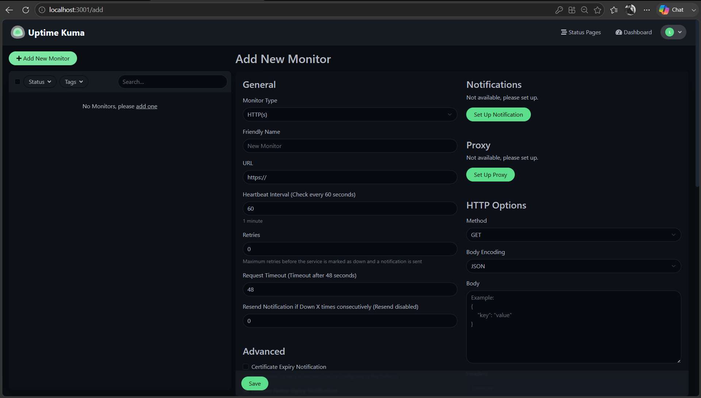

# Create Your First HTTP Monitor

An HTTP monitor periodically sends requests to a website or web service and records whether it responds successfully.

This guide shows you how to create your first HTTP monitor in Uptime Kuma and verify that it is working.

## Before you begin

Make sure:

- Uptime Kuma is running.
- You can access the Uptime Kuma dashboard.
- You have a website or HTTP endpoint to monitor.

This guide uses `https://www.google.com` as an example.

## Create an HTTP monitor

1. Sign in to Uptime Kuma.
2. Select **Add New Monitor**.
3. From **Monitor Type**, select **HTTP(s)**.
4. Enter `Google` in **Friendly Name**.
5. Enter `https://www.google.com` in **URL**.

The default HTTP monitor configuration includes:

- **Heartbeat Interval:** 60 seconds
- **Retries:** 0
- **Request Timeout:** 48 seconds
- **HTTP Method:** GET
- **Accepted Status Codes:** 200–299

For this first monitor, leave these settings at their default values.



*HTTP monitor configuration for the Google website.*

## Save the monitor

Select **Save**.

Uptime Kuma begins checking the URL and opens the monitor details page.

If the website responds successfully, the monitor displays an **Up** status.


*An HTTP monitor reporting that the monitored website is Up.*

## Verify the monitor

On the monitor details page, verify that the status is **Up**.

The page also displays information about the monitor, including:

- Response time
- Average response time
- Uptime
- Heartbeat history
- HTTP response status
- Certificate and domain information, when available

For a successful request, the heartbeat history can display a response such as:

```text
200 - OK
```

A green heartbeat represents a successful check.

Uptime Kuma continues checking the website according to the configured heartbeat interval. With the default 60-second interval, the monitor performs another check approximately every minute.

## Test a failed check

You can create a separate monitor with an intentionally invalid domain to observe how Uptime Kuma reports a failed check.

> **Note:** Use a separate test monitor rather than modifying a monitor that you rely on for actual availability monitoring.

Create another **HTTP(s)** monitor with the following values:

```text
Friendly Name: Test Monitor
URL: https://this-domain-should-not-exist-uptime-kuma.example
```

Leave the remaining settings at their defaults and select **Save**.

The `.example` top-level domain is reserved for documentation and examples, making it suitable for this controlled test.

Because the domain cannot be resolved, Uptime Kuma reports the monitor as **Down**.


*Uptime Kuma reporting a failed check for the test monitor.*

During our test, Uptime Kuma reported:

```text
getaddrinfo ENOTFOUND this-domain-should-not-exist-uptime-kuma.example
```

`ENOTFOUND` indicates that the hostname could not be resolved through DNS.

A failed Uptime Kuma check does not, by itself, prove that a remote website is globally unavailable. A check can also fail because of DNS, networking, timeout, TLS, or other connectivity problems between Uptime Kuma and the monitored service.

## Understand Up and Down states

An **Up** status means that the latest check satisfied the monitor's configured success conditions.

A **Down** status means that the check failed to satisfy those conditions.

For the HTTP monitors created in this guide:

- `200 - OK` produced a successful check.
- The DNS resolution failure produced a failed check.

The monitor details page records these checks as heartbeats, allowing you to see changes in availability over time.

## Pause and resume a monitor

You can temporarily stop Uptime Kuma from checking a monitor without deleting it.

Open the monitor and select **Pause**.

While the monitor is paused, Uptime Kuma stops performing its scheduled checks. A paused monitor should therefore not be interpreted as a service that is Down.

To begin checking the service again, select **Resume**.

After the monitor resumes, new heartbeat and availability information appears as Uptime Kuma performs new checks.

## Next step

Your HTTP monitor is now configured and collecting availability information.

You can next configure notifications so that Uptime Kuma alerts you when a monitor goes Down and when it recovers.

## Next steps

- [Understand monitor status and results](monitor-status-and-results.md).
- [Configure Telegram notifications](configure-telegram-notifications.md).