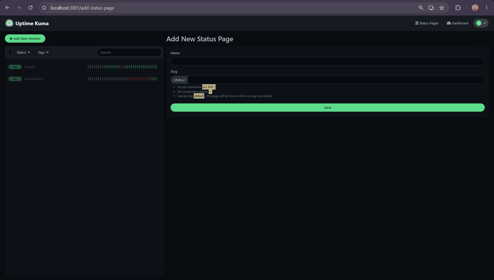
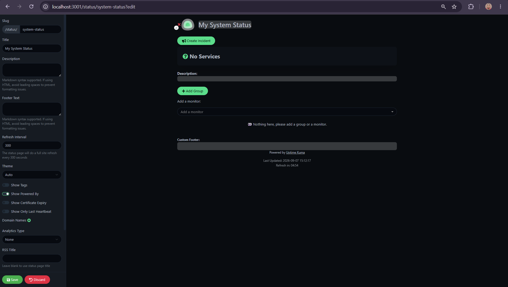
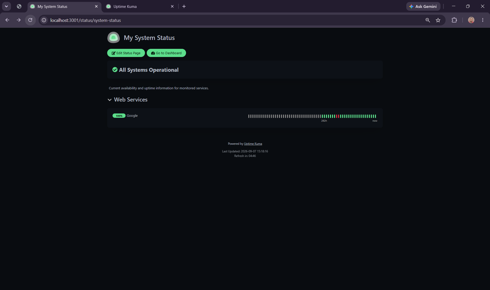

# Create a Status Page

A status page provides a shareable view of selected Uptime Kuma monitors. You can use it to communicate the availability of websites and services without giving visitors access to the Uptime Kuma administration dashboard.

This guide shows you how to create a status page, organize a monitor into a group, and verify the published monitoring information.

## Before you begin

Make sure you have:

- A running Uptime Kuma instance.
- At least one configured monitor.
- Access to the Uptime Kuma dashboard.

This guide uses an HTTP monitor named **Google** as an example.

## Create a status page

1. Sign in to Uptime Kuma.
2. Select **Status Pages** from the navigation bar.
3. Select **New Status Page**.
4. In **Name**, enter:

   ```text
   My System Status
   ```

5. In **Slug**, enter:

   ```text
   system-status
   ```



*Creating a status page with a name and URL slug.*

The **Name** identifies the status page to visitors.

The **Slug** identifies the page in its URL. With the slug used in this example, the local status page is available at:

```text
http://localhost:3001/status/system-status
```

The status-page interface accepts lowercase letters, numbers, and hyphens in the slug. It does not accept consecutive hyphens.

Select **Next** to configure the page.

## Add a description

In **Description**, enter:

```text
Current availability and uptime information for monitored services.
```

Uptime Kuma supports Markdown in the status-page description.

The description appears near the top of the published page and can provide visitors with additional context about the services being monitored.

## Create a monitor group

Groups organize related monitors on a status page.

Select **Add Group**, and name the group:

```text
Web Services
```

You can use separate groups when a status page contains different categories of services.

For example, a larger deployment might organize monitors into groups such as web services, APIs, databases, or internal systems.

## Add a monitor

Under the new **Web Services** group, add the **Google** monitor.



*Status page configuration with the Google monitor added to the Web Services group.*

Only add monitors whose information you intend to expose through the status page.

The status page is separate from the administration dashboard. It presents selected monitoring information rather than providing access to the full Uptime Kuma management interface.

## Save the status page

Leave the remaining settings at their defaults for this example and select **Save**.

Uptime Kuma publishes the status page and displays the monitoring information associated with the selected monitor.

## Verify the status page

Open:

```text
http://localhost:3001/status/system-status
```

The page should display:

- The status-page name.
- The description.
- An overall system status.
- The **Web Services** group.
- The **Google** monitor.
- Recent monitoring information.

When the monitor is operating successfully, the page can display an overall state such as:

```text
All Systems Operational
```


*Published status page showing the Google monitor as operational.*

The page also displays recent heartbeat information so visitors can see the monitor's recent availability.

## Understand the overall status

The status page summarizes the state of the monitors included on the page.

If the included monitors are operating normally, Uptime Kuma can display:

```text
All Systems Operational
```

This gives visitors a high-level view before they inspect individual services.

The individual monitor entries provide more specific monitoring information.

## Understand paused monitors

A monitor can be paused from the Uptime Kuma dashboard.

When a monitor is paused, Uptime Kuma stops performing its scheduled checks. A paused monitor should not be interpreted as a service that has been confirmed Down.

During testing, our Google monitor had previously been paused. When we first viewed the status page, the monitor displayed `0%` even though historical heartbeat information was visible.

After we resumed the monitor and Uptime Kuma performed new successful checks, the status page displayed the monitor at `100%`.



*Status page showing the Google monitor after monitoring resumed and successful checks were recorded.*

This behavior demonstrates why status-page metrics should be interpreted in the context of the monitor's current state and available monitoring data.

## Configure status-page options

The status-page editor provides additional configuration options beyond the basic setup in this guide.

These include options for:

- Themes
- Page refresh intervals
- Tags
- Certificate-expiry information
- Domain-expiry information
- Custom footer text
- Incidents
- Analytics
- RSS feeds

You do not need to configure these options to create a basic status page.

Configure additional options according to the information and functionality you want to make available to status-page visitors.

## Share a status page

A status page can provide users with service-health information without exposing the Uptime Kuma administration dashboard.

For a locally hosted instance, the status page in this guide is available only through the local Uptime Kuma address:

```text
http://localhost:3001/status/system-status
```

Making a status page available to users outside your local environment requires deploying Uptime Kuma somewhere those users can reach. Do not assume that a `localhost` status page is publicly accessible over the internet.

## Next steps

You now have an Uptime Kuma setup that can:

- Monitor an HTTP endpoint.
- Record successful and failed checks.
- Send Telegram notifications for status changes.
- Display selected monitoring information on a status page.

You can continue by adding additional monitors, notification providers, and status-page configuration as your monitoring requirements grow.