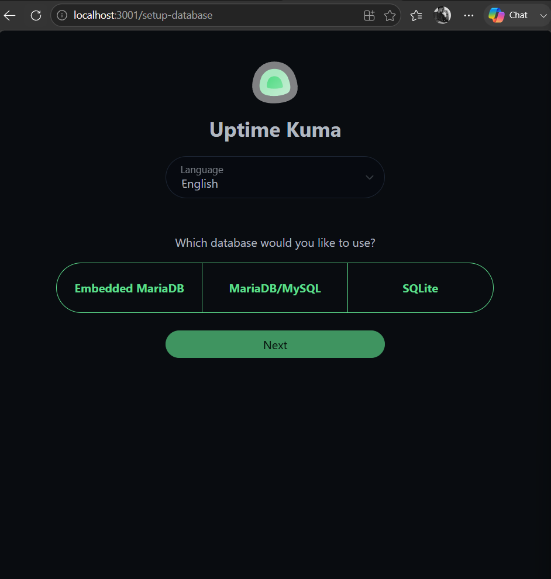
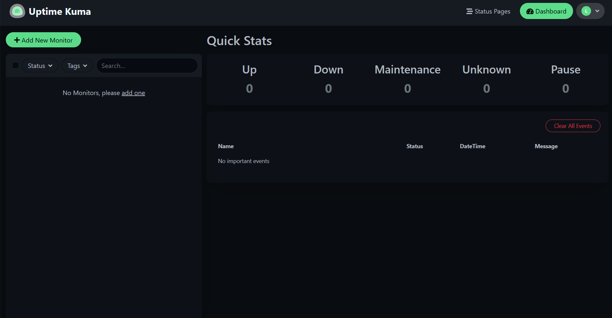

# Install Uptime Kuma with Docker Compose

Uptime Kuma is a self-hosted monitoring tool for tracking the availability and performance of websites and services. This guide shows you how to run Uptime Kuma locally with Docker Compose and complete the initial setup.

By the end of this guide, you will have a running Uptime Kuma instance that you can access from your browser.

## Prerequisites

Before you begin, make sure you have:

- Docker Desktop installed and running.
- Access to PowerShell or another command-line terminal.
- An internet connection to download the Uptime Kuma Docker image.

Verify that Docker is installed:

```powershell
docker --version
```

The command should return the installed Docker version.

Verify that Docker Compose is available:

```powershell
docker compose version
```

The command should return the installed Docker Compose version.

If either command fails, confirm that Docker Desktop is installed and running before continuing.

## Create the project directory

Create a directory for the Uptime Kuma project and navigate to it:

```powershell
mkdir uptime-kuma-project
cd uptime-kuma-project
```

The directory will contain the Compose configuration used to run Uptime Kuma.

## Download the Compose file

Download the official Uptime Kuma Compose configuration:

```powershell
curl.exe -o compose.yaml https://raw.githubusercontent.com/louislam/uptime-kuma/master/compose.yaml
```

Verify that the file exists:

```powershell
dir
```

You should see `compose.yaml` in the directory.

> **Note:** Uptime Kuma 2.x uses the `louislam/uptime-kuma:2` Docker image. The downloaded Compose configuration defines the Uptime Kuma service, persistent storage, and the port used to access the application.

> **Important:** Store Uptime Kuma data on a local directory or Docker volume. Network filesystems such as NFS are not supported and can cause database locking or corruption problems.

## Start Uptime Kuma

Start Uptime Kuma in the background:

```powershell
docker compose up -d
```

Docker Compose downloads the required image if it is not already available and starts the Uptime Kuma container.

The first startup can take longer while Docker downloads the image.

## Verify that Uptime Kuma is running

Check the container status:

```powershell
docker compose ps
```

A successful installation should show the `uptime-kuma` service running and healthy. The output should also show port `3001` mapped from the container to the host.

## Open Uptime Kuma

Open a browser and go to:

```text
http://localhost:3001
```

On the first launch, Uptime Kuma displays its initial database setup page.



*Uptime Kuma database selection during initial setup.*

For this local installation, select **SQLite**, and then select **Next**.

SQLite provides a straightforward setup for a local Uptime Kuma instance because it does not require you to configure a separate database server.

## Create the administrator account

After configuring the database, Uptime Kuma prompts you to create the administrator account.

Enter the requested account information and create a secure password. Keep these credentials somewhere secure because you will use them to access the Uptime Kuma administration dashboard.

> **Security:** Do not include your administrator password in screenshots, documentation, Git repositories, or other publicly accessible files.

## Verify the installation

After completing the account setup, Uptime Kuma opens the monitoring dashboard.



*Uptime Kuma dashboard after a successful installation.*

If the dashboard loads successfully, Uptime Kuma is installed and ready for monitoring configuration.

## Troubleshoot Docker connection errors

When starting Uptime Kuma, you might encounter an error similar to:

```text
unable to get image 'louislam/uptime-kuma:2'
open //./pipe/dockerDesktopLinuxEngine:
The system cannot find the file specified.
```

This error can occur when Docker Desktop's Linux container engine is not running.

Open Docker Desktop and wait for Docker to finish starting. Then run:

```powershell
docker compose up -d
```

Verify the container again:

```powershell
docker compose ps
```

If the service reports that it is running and healthy, return to:

```text
http://localhost:3001
```

## Stop and restart Uptime Kuma

Stop the containers:

```powershell
docker compose down
```

To start Uptime Kuma again:

```powershell
docker compose up -d
```

The Compose configuration stores Uptime Kuma data in persistent storage. Restarting or recreating the container with the same storage preserves the application data.

## Next step

Uptime Kuma is now installed and ready to monitor services.

Next, [create your first HTTP monitor](create-http-monitor.md).