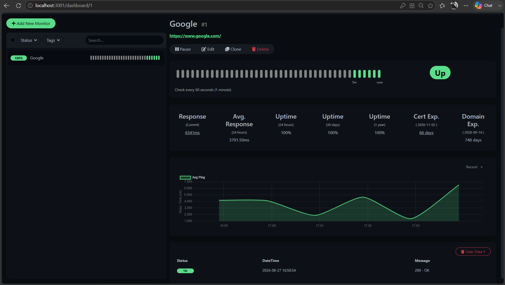
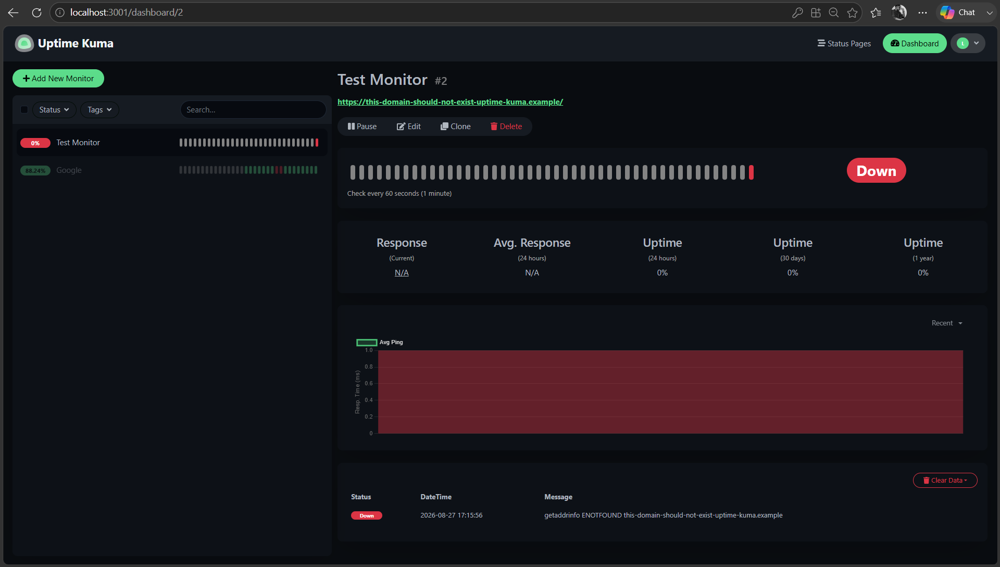
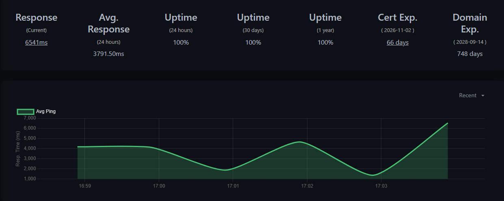
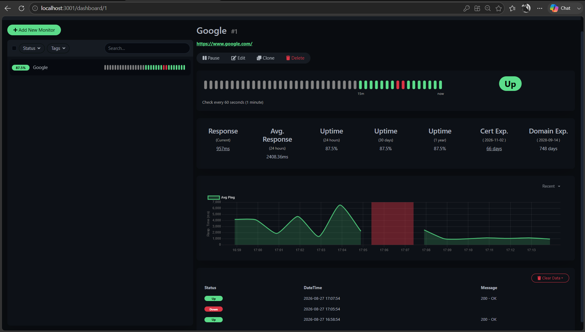

# Understand Monitor Status and Results

Uptime Kuma records the result of each monitor check and uses those results to show the current state and recent behavior of a monitored service.

Understanding these results helps you distinguish between a service that is responding normally, a failed check, and a monitor that is not currently performing checks.

## Monitor status

A monitor can display different states depending on the result of its checks and its current configuration.

### Up

**Up** indicates that the latest check met the monitor's configured success conditions.

For an HTTP monitor using the default accepted status codes of `200–299`, a successful request might return:

```text
200 - OK
```

Uptime Kuma represents successful heartbeats in green.



*An HTTP monitor showing an Up status and successful heartbeat history.*

### Down

**Down** indicates that the latest check did not meet the monitor's success conditions.

A monitor can go Down for different reasons. These include an HTTP error, DNS resolution failure, connection problem, or timeout.

For example, a test using an intentionally unresolvable domain produced:

```text
getaddrinfo ENOTFOUND this-domain-should-not-exist-uptime-kuma.example
```

In this case, `ENOTFOUND` indicates that the hostname could not be resolved through DNS.



*An HTTP monitor showing a Down status after a DNS resolution failure.*

A Down result describes the outcome of Uptime Kuma's check. It does not necessarily prove that the monitored service is unavailable to every user. Problems with DNS, networking, TLS, or connectivity between the Uptime Kuma instance and the target can also cause a check to fail.

### Paused

A paused monitor does not perform its scheduled checks.

Pausing can be useful when you temporarily do not want to monitor a service but want to keep its configuration.

A paused monitor is different from a Down monitor:

- **Down** means Uptime Kuma performed a check and the check failed.
- **Paused** means Uptime Kuma is not currently performing scheduled checks.

When you resume the monitor, Uptime Kuma begins checking it again.

## Heartbeats

Uptime Kuma records monitor check results as heartbeats. Heartbeat history lets you review successful and failed checks over time.

For an HTTP monitor configured with a 60-second heartbeat interval, Uptime Kuma attempts a new check approximately every minute.

Successful and failed heartbeats appear in the monitor history, making it possible to see changes in availability over time.

A sequence of green heartbeats indicates successful checks. A failed check appears differently, allowing you to identify when the monitor detected a problem and when subsequent checks succeeded again.

## Response time

Response time shows how long a monitored service took to respond to a check.

The monitor details page displays the current response time and can also display an average response time calculated from recorded checks.

Uptime Kuma plots response times on a graph, which makes changes in response behavior easier to identify.



*Response-time history for an HTTP monitor.*

A successful response does not necessarily mean that response time will always remain constant. Network conditions and the behavior of the monitored service can cause individual checks to take different amounts of time.

## Uptime

Uptime represents the proportion of recorded monitoring results that were successful over a displayed period.

The monitor details page can show uptime information for periods such as:

- 24 hours
- 30 days
- 1 year

Interpret these values in the context of the monitoring data that is actually available.

For example, a newly created monitor has not been running for 30 days or one year simply because the interface displays those time ranges. Do not interpret a displayed 30-day or 1-year percentage as evidence that the service has been monitored continuously for that entire period.

## HTTP status results

For HTTP monitors, Uptime Kuma records information about the HTTP response.

A successful request in our test returned:

```text
200 - OK
```

By default, the HTTP monitor we tested accepted status codes in the `200–299` range.

The accepted status-code setting determines which HTTP responses Uptime Kuma treats as successful. If you change this configuration, the meaning of a successful check can change accordingly.

## Failure and recovery

Monitor history becomes especially useful when a service changes state.

During testing, our monitor transitioned from:

```text
Up → Down → Up
```

The failed check appeared in the heartbeat history, followed by successful checks when the monitor recovered.



*Heartbeat history showing a failed check followed by successful checks.*

A recovery therefore represents a new successful check after a previous Down state.

If notifications are configured, Uptime Kuma can also send alerts for these state changes.

## Certificate and domain information

For HTTPS websites, the monitor details page can display additional information such as certificate and domain expiry information when available.

These details complement availability monitoring but should not be confused with the monitor's basic HTTP response result.

A website can respond successfully while still having certificate or domain information that requires attention.

## Interpret monitoring results carefully

Monitoring results describe what Uptime Kuma observed from its own checks.

When investigating a Down state, use the accompanying error information to determine why the check failed rather than assuming immediately that the monitored service itself is completely unavailable.

For example:

```text
200 - OK
```

indicates that the HTTP request completed successfully according to the monitor's configured conditions, while:

```text
getaddrinfo ENOTFOUND ...
```

points specifically to a DNS resolution failure.

Understanding the underlying result makes monitoring information more useful for troubleshooting and incident response.

## Next step

[Configure Telegram notifications](configure-telegram-notifications.md) to receive alerts when a monitor changes status.
